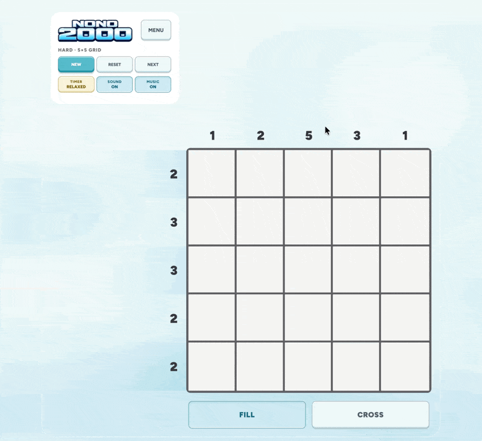

# NONO2000

Nostalgic 2000s nonogram vibes.

[Play NONO2000](https://lukeylias.github.io/NONO2000/)

NONO2000 generates a fresh picture-logic puzzle whenever you start a new grid. Every generated puzzle has one solution and can be completed without guessing.

## Rules

- The numbers beside each row and column describe consecutive groups of filled squares.
- Multiple numbers mean separate groups with at least one empty square between them.
- Fill every square that belongs to the hidden pattern.
- Crosses mark squares that should stay empty.
- The puzzle is complete when every required square is filled.

For example, a clue of `3 1` means three consecutive filled squares, at least one empty square, then one filled square.

## Controls

- Left-click or drag to fill squares.
- Right-click to place crosses.
- A wrong move remains marked and stops the current drag.
- Marked squares stay locked for that attempt.
- A wrong Cross on a required square still fills it but keeps a red X.
- Completing a row or column crosses its remaining empty squares automatically.

## Game options

- Grid sizes: 5x5, 10x10, and 15x15.
- The 10x10 grid has Beginner, Standard, and Hard puzzle profiles.
- Relaxed mode has no timer.
- Timed games last 1, 2, or 5 minutes.
- A wrong Fill or Cross removes 15 seconds in timed games.
- Pausing stops the countdown. Interacting with the board resumes play.

## Music

"Nostalgic Liquid Jungle DnB - Loopable Edit" by Musinova, used under the [Pixabay Content License](https://pixabay.com/service/license-summary/).
